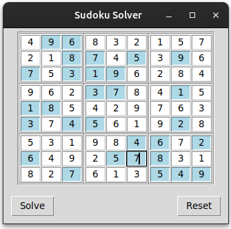

# Sudoku Solver

This is a simple Sudoku solver application created using Python's `tkinter` library. The app provides a graphical user interface (GUI) where users can input Sudoku puzzle values, and it uses a backtracking algorithm to solve the puzzle. The application also checks for valid input and highlights invalid entries.

## Features

- A 9x9 grid for Sudoku puzzle input.
- Validation of input values to ensure only digits between 1 and 9 are allowed.
- Ability to move between input cells using arrow keys.
- Solving the puzzle using the backtracking algorithm.
- Provides a solution, highlighting the solved cells with a light blue color.
- Options to reset the grid and clear the puzzle.

## Requirements

- Python 3.x
- tkinter library (typically comes pre-installed with Python)

## How to Use

1. Input the Sudoku puzzle by filling in the numbers in the grid.
2. Press the "Solve" button to solve the puzzle.
3. If more than one solution exists, the app will prompt you to continue or stop.
4. Press the "Reset" button to clear the grid and start over.

## Code Structure

- **Tkinter GUI Setup**: The window and grid are created using tkinter's `LabelFrame` and `Entry` widgets.
- **Input Validation**: A function to ensure only valid Sudoku entries (numbers 1-9) are entered.
- **Backtracking Algorithm**: The main logic for solving the Sudoku puzzle. It uses a depth-first search to explore possible values for each empty cell.
- **Buttons**: Two buttons are provided:
  - **Solve**: Triggers the solving process.
  - **Reset**: Clears the grid and resets the puzzle.

## Functions

- `validate_input(input_string)`: Ensures only valid input values are entered.
- `move_focus(event)`: Allows users to move between cells using arrow keys.
- `write_in_arr()`: Reads values from the grid and stores them in a 2D array.
- `write()`: Writes the solved puzzle back to the grid.
- `solve()`: The backtracking algorithm that attempts to solve the Sudoku puzzle.
- `changePrevious()`: A helper function for backtracking to previous cells when no valid value can be placed.
- `solve_button()`: Handles the solving process when the "Solve" button is clicked.
- `reset()`: Clears the grid and resets the puzzle state.

## Usage

1. Clone or download the repository to your local machine.
2. Run the `sudoku_solver.py` script using Python.
3. The GUI window will open, and you can begin inputting your puzzle.
4. Click "Solve" to get the solution or "Reset" to clear the puzzle.

